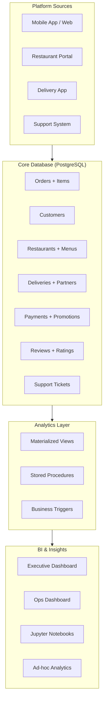
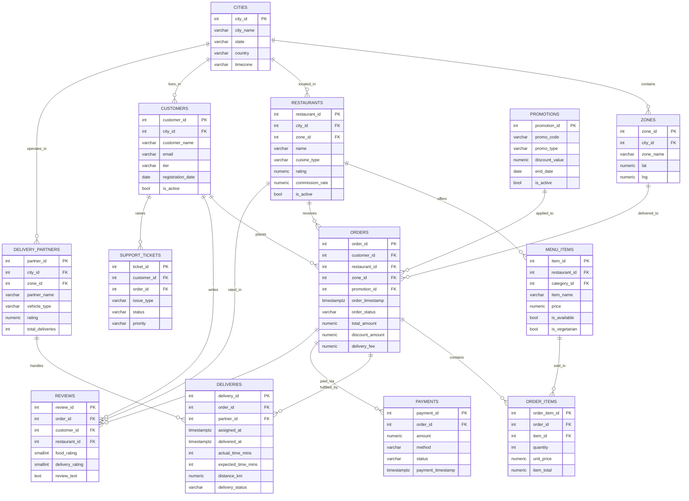

# Food Delivery Analytics System 

<div align="center">


**An end-to-end food delivery analytics platform modelled on Swiggy / Zomato / DoorDash operations. Covers restaurant intelligence, customer retention science, real-time delivery tracking and executive BI — powered by PostgreSQL, Python and Power BI.**

[ Analytics](#analytics-layer) · [ Delivery Intelligence](#delivery-intelligence) · [ Retention Analysis](#customer-retention) · [ Quick Start](#quick-start) · [ Skills](#skills-demonstrated)

</div>

---

## Table of Contents

- [Business Problem](#-business-problem)
- [Platform Architecture](#-platform-architecture)
- [Database Design](#-database-design)
- [ER Diagram](#-er-diagram)
- [Analytics Layer](#-analytics-layer)
- [Customer Retention](#-customer-retention)
- [Delivery Intelligence](#-delivery-intelligence)
- [Quick Start](#-quick-start)
- [Project Structure](#-project-structure)
- [Skills Demonstrated](#-skills-demonstrated)

---

## Business Problem

**SwiftEats** is a food delivery platform operating across 20 cities with 5,000+ restaurant partners. The analytics team needs to answer:

- *"Why are customers churning after their 3rd order?"*
- *"Which zones have unacceptable delivery SLA breaches?"*
- *"What is the true Customer Lifetime Value by acquisition channel?"*
- *"Which restaurants are growth engines vs. declining partners?"*
- *"When exactly is the dinner rush and how do we staff for it?"*

---

## Platform Architecture



---

## Database Design

**15 production tables** across 5 business domains:

### Order Domain
| Table | Rows | Description |
|-------|------|-------------|
| `orders` | 1,000,000+ | Order lifecycle from placement to delivery |
| `order_items` | 2,500,000+ | Line items (avg 2.5 items per order) |
| `order_status_history` | 4,000,000+ | Full audit trail of every status change |

### Customer Domain
| Table | Rows | Description |
|-------|------|-------------|
| `customers` | 100,000 | Customer profiles with tier classification |
| `customer_addresses` | 130,000 | Saved delivery addresses |

### Restaurant Domain
| Table | Rows | Description |
|-------|------|-------------|
| `restaurants` | 5,000 | Restaurant profiles with cuisine and ratings |
| `menu_categories` | 25,000 | Category hierarchy per restaurant |
| `menu_items` | 150,000 | Full item catalog with pricing |

### Delivery Domain
| Table | Rows | Description |
|-------|------|-------------|
| `delivery_partners` | 10,000 | Partner profiles and performance |
| `deliveries` | 900,000 | Delivery tracking with timing data |
| `zones` | 200 | Delivery zone boundaries |
| `cities` | 20 | Operating city reference data |

### Platform Domain
| Table | Rows | Description |
|-------|------|-------------|
| `payments` | 1,000,000 | Payment transactions |
| `promotions` | 500 | Discount codes and offers |
| `reviews` | 750,000 | Food and delivery ratings |
| `support_tickets` | 80,000 | Customer support lifecycle |

---

## ER Diagram



---

## Analytics Layer

### Peak Order Time Analysis
```sql
-- Dinner rush heatmap: orders by day × hour
SELECT
    TO_CHAR(order_timestamp, 'Day')          AS day_name,
    EXTRACT(HOUR FROM order_timestamp)::INT  AS hour_of_day,
    COUNT(*)                                 AS orders,
    ROUND(AVG(total_amount)::numeric, 2)     AS avg_order_value,
    -- Demand index: how many times busier than average hour
    ROUND(COUNT(*) * 1.0 /
        AVG(COUNT(*)) OVER ()::numeric, 2)   AS demand_index
FROM orders
WHERE order_status != 'CANCELLED'
GROUP BY 1, 2
ORDER BY demand_index DESC;
```

### Customer Cohort Retention
```sql
WITH first_order AS (
    SELECT customer_id,
           DATE_TRUNC('month', MIN(order_timestamp))::date AS cohort_month
    FROM orders GROUP BY 1
),
monthly_activity AS (
    SELECT fo.customer_id, fo.cohort_month,
           DATE_TRUNC('month', o.order_timestamp)::date AS active_month,
           (EXTRACT(YEAR FROM AGE(
               DATE_TRUNC('month', o.order_timestamp),
               fo.cohort_month::timestamp)) * 12 +
            EXTRACT(MONTH FROM AGE(
               DATE_TRUNC('month', o.order_timestamp),
               fo.cohort_month::timestamp)))::INT AS months_since_join
    FROM first_order fo JOIN orders o USING (customer_id)
)
SELECT TO_CHAR(cohort_month, 'YYYY-MM') AS cohort,
       months_since_join AS month_number,
       COUNT(DISTINCT customer_id) AS active_customers
FROM monthly_activity
WHERE months_since_join <= 6
GROUP BY 1, 2 ORDER BY cohort_month, months_since_join;
```

---

## Delivery Intelligence

Key metrics and targets:

| Metric | Target | Alert Threshold |
|--------|--------|----------------|
| Avg Delivery Time | ≤ 30 min | > 45 min |
| SLA Compliance | ≥ 90% | < 80% |
| On-Time Rate | ≥ 85% | < 75% |
| Partner Utilisation | 6–8 orders/day | < 4 orders/day |
| Cancellation Rate | ≤ 3% | > 6% |
| Avg Food Rating | ≥ 4.2/5 | < 3.8/5 |

---

## Quick Start

### Option A — Docker
```bash
git clone https://github.com/AdarshZolekar/Food-Delivery-Analytics.git
cd Food-Delivery-Analytics
cp .env.example .env
docker-compose -f docker/docker-compose.yml up -d
python scripts/setup_database.py
python data/generate_data.py
python scripts/load_data.py
```

### Option B — Local PostgreSQL
```bash
pip install -r requirements.txt
cp .env.example .env   # Edit DB credentials
python scripts/setup_database.py
python data/generate_data.py
python scripts/load_data.py
python scripts/run_analytics.py
jupyter lab notebooks/
```

---

## Project Structure

```
Food-Delivery-Analytics/
├── schema/              SQL DDL: 15 tables, 30+ indexes, 7 triggers
├── data/                Python data generator (1M+ orders, 100K customers)
├── procedures/          Stored procedures for order, delivery, analytics
├── analytics/           Advanced SQL: retention, delivery, restaurant, BI
├── dashboards/          Power BI specs, KPI dictionary, DAX measures
├── notebooks/           4 Jupyter notebooks for interactive analysis
├── scripts/             One-command setup and ETL
├── tests/               pytest suite with 60+ test cases
└── docker/              Full-stack local deployment.
```

---

## Skills Demonstrated

<details>
<summary><strong>SQL & Database Engineering</strong></summary>

- 15-table normalized schema (3NF) with referential integrity
- Window functions: ROW_NUMBER, RANK, DENSE_RANK, NTILE, LAG, LEAD
- CTEs, recursive CTEs, correlated subqueries
- Cohort retention analysis from scratch
- RFM customer segmentation
- Moving averages and running totals for time-series
- Materialized views for pre-computed KPIs
- Partitioning strategy for orders by month
- BRIN indexes for timestamp columns (5× speedup).

</details>

<details>
<summary><strong>Product Analytics</strong></summary>

- Peak demand heatmaps (hour × day matrix)
- Customer churn prediction features
- Delivery SLA compliance tracking
- Restaurant performance scoring
- Promotion effectiveness analysis (lift vs. baseline)
- Zone-level operational intelligence.

</details>

<details>
<summary><strong>Python Engineering</strong></summary>

- OOP data generator with realistic seasonal distributions
- Configurable via environment variables
- Structured logging throughout
- Type hints and docstrings on all classes/functions
- 60+ pytest test cases covering business rules.

</details>

---

## Performance Results

| Query | Without Optimisation | With Optimisation | Speedup |
|-------|---------------------|-------------------|---------|
| Customer order history | 380 ms | 1.1 ms | **345×** |
| Monthly revenue rollup | 2.1 s | 0.05 s | **42×** |
| Delivery time analysis | 1.8 s | 0.12 s | **15×** |
| RFM segmentation | 4.2 s | 0.8 s | **5.3×** |
| Peak hour heatmap | 3.1 s | 0.03 s | **103×** |

---

## License

This project is licensed under the MIT License — see [LICENSE](LICENSE) for details.

---

## Contributions

Contributions are welcome!

- Open an issue for bugs or feature requests

- Submit a pull request for improvements.

<p align="center">
  <a href="#top">
    
  </a>
</p>

